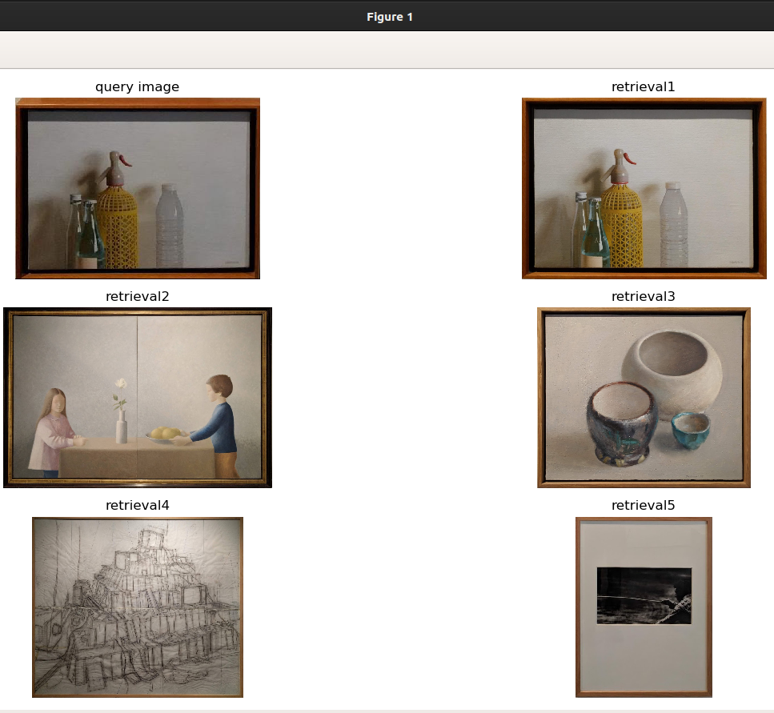

# Week 3 API Usage

## Content Based Image Retrieval

Use `fastsearch.py` to get the map@K measure. To check its usage, run:

```$ python fastsearch.py -h```

````
$ python fastsearch.py -h
usage: fastsearch.py [-h] [--pickle] [--plot] [--use_masks]
                     [--museum_path MUSEUM_PATH] [--query_path QUERY_PATH]
                     [--descriptor DESCRIPTOR] [--metric METRIC] [--bins BINS]
                     [--map_k MAP_K]

Content Based Image Retrieval

optional arguments:
  -h, --help            show this help message and exit
  --pickle, -p          Generate pickle file with results
  --plot, -v            show retrieval results for a random query image
  --use_masks           whether to use masks for histogram generation or not.
                        Using masks helps us improve our features by extract
                        the painting(foreground) from the background and also
                        removing any text present on the painting
  --museum_path MUSEUM_PATH, -r MUSEUM_PATH
                        path to reference museum dataset. Example input:
                        'data/BBDD'
  --query_path QUERY_PATH, -q QUERY_PATH
                        path to query museum dataset. Example input:
                        'data/qsd1_w1'
  --descriptor DESCRIPTOR, -d DESCRIPTOR
                        descriptor for extracting features from image.
                        DESCRIPTORS AVAILABLE: 1D and 3D Histograms -
                        gray_historam, rgb_histogram_1d, rgb_histogram_3d,
                        hsv_histogram_1d, hsv_histogram_3d, lab_histogram_1d,
                        lab_histogram_3d, ycrcb_histogram_1d,
                        ycrcb_histogram_3d. Block and Pyramidal Histograms -
                        lab_histogram_3d_pyramid and more. lab_histogram_3d
                        gives us the best results.
  --metric METRIC, -m METRIC
                        similarity measure to compare images. METRICS
                        AVAILABLE: cosine, manhattan, euclidean, intersect,
                        kl_div, js_div bhattacharyya, hellinger, chisqr,
                        correl. hellinger and js_div give the best results.
  --bins BINS, -b BINS  number of bins to use for histograms
  --map_k MAP_K, -k MAP_K
                        Mean average precision of top-K results
````


## Background removal
Masks are generated and evaluated (if ground truth is available) by using the script `masks.py`. To check its usage, run:

```$ python masks.py -h```

````
$ python masks.py -h
usage: masks.py [-h] [--query QUERY]
                [--retriever {color_mono,color_multi_rgb,color_multi_hsv,color_multi_sv,color_multi_lab,color_multi_ycbcr,color_multi_xyz,edges}]
                [--output OUTPUT]

Generates, evaluates and stores (optional, see --output) masks generated from
the given query dataset.

optional arguments:
  -h, --help            show this help message and exit
  --query QUERY         Path to query dataset.
  --retriever {color_mono,color_multi_rgb,color_multi_hsv,color_multi_sv,color_multi_lab,color_multi_ycbcr,color_multi_xyz,edges}
                        Mask retriever method to use. Options Available:
                        color_mono, color_multi_rgb, color_multi_hsv,
                        color_multi_sv, color_multi_lab, color_multi_ycbcr,
                        color_multi_xyz, edges
  --output OUTPUT       Path to folder where generated masks will be stored.
                        Results are not saved if unspecified.
````
## Visualizing Results

Use command line argument "-v" to plot the top results for a random query image.

````python fastsearch.py -v````

<br>
